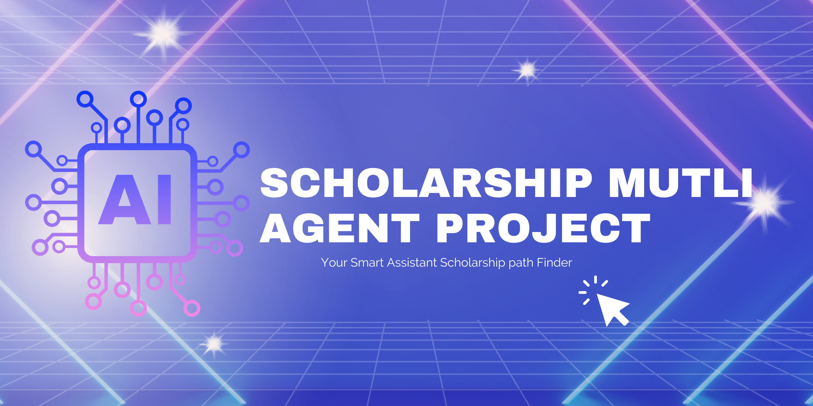

<div align="center">

# 🎓 Smart Multi-Agent Scholarship Assistant



> An AI-powered multi-agent system that reads your CV or personal statement, extracts your academic profile, and matches you with the best global scholarship opportunities — then generates a personalised advisory report.


</div>

---

## Table of Contents

- [Overview](#overview)
- [How It Works](#how-it-works)
- [Features](#features)
- [Tech Stack](#tech-stack)
- [Getting Started](#getting-started)
  - [Prerequisites](#prerequisites)
  - [Installation](#installation)
- [Usage](#usage)
- [Project Structure](#project-structure)
- [Agent Architecture](#agent-architecture)
- [License](#license)

---

## Overview

**ScholarPath AI** is a multi-agent scholarship recommendation system built for Egyptian and international students seeking postgraduate funding opportunities abroad.

It solves the overwhelming complexity of scholarship research by automating three hard steps:

1. **Profile extraction** — paste your CV or upload a PDF and the system extracts your academic profile using a quantised LLM (Gemma-2-9B-IT)
2. **Intelligent matching** — a pipeline of specialised agents filters universities by QS ranking and scholarships by your exact eligibility (IELTS, GRE, degree level, field, return obligation, etc.)
3. **Personalised advisory report** — the LLM writes a detailed, student-addressed report covering fit analysis, deadlines, acceptance rate estimates, and direct application links

Unlike generic scholarship databases, ScholarPath AI filters by *your actual scores*, respects constraints you can't change (e.g. no GRE, no return obligation), and explains *why* each match fits you.

---

## How It Works

```
Your CV / Personal Statement
          │
          ▼
  ┌───────────────────┐
  │  Agent 1          │  Gemma-2-9B-IT (4-bit quantised)
  │  Profiling Agent  │  Extracts: GPA, IELTS, GRE, degree,
  │                   │  domain, projects, experience, etc.
  └────────┬──────────┘
           │  Structured UserProfile
           ▼
  ┌───────────────────┐
  │  Agent 2a         │  Reads Universities.xlsx
  │  University       │  Filters by domain sheet → Top 20
  │  Filter Agent     │  universities by QS 2026 rank
  └────────┬──────────┘
           │
  ┌────────▼──────────┐
  │  Agent 2b         │  Reads Scholarships.xlsx
  │  Scholarship      │  Filters by: degree, IELTS, field,
  │  Filter Agent     │  GRE, experience, return obligation,
  │                   │  graduation certificate
  └────────┬──────────┘
           │
  ┌────────▼──────────┐
  │  Agent 2c         │  Joins scholarships to top-ranked
  │  Matching Agent   │  universities/countries → Top 5 matches
  └────────┬──────────┘
           │  Top 5 Scholarship DataFrame
           ▼
  ┌───────────────────┐
  │  Agent 3          │  Gemma-2-9B-IT generates a Markdown
  │  Report Agent     │  advisory report personalised to the
  │                   │  student by name, scores, and interests
  └────────┬──────────┘
           │
           ▼
    Streamlit UI  ──►  In-browser report  +  PDF download
```

---

## Features

### 📥 Data Ingestion & Extraction
- ✅ **CV / PDF ingestion** — upload a PDF or paste text; the Gemma-2-9B-IT LLM extracts a structured profile automatically
- ✅ **Form pre-fill** — extracted fields (GPA, IELTS, degree, domain, projects, experience…) auto-populate the UI form via UserProfile Pydantic schema mapping
- ✅ **Intelligent Data Bridging** — a dedicated bridge function translates unstructured LLM output (Pydantic) into the strict dictionary format required by the Pandas filtering engine

### 🔍 Filtering & Matching Engine
- ✅ **Multi-constraint eligibility engine** — strict Pandas-based filtering for GRE, experience, return obligation, graduation certificate, degree level, and field restrictions
- ✅**Score-aware filtering (IELTS & TOEFL)** — parses complex strings (e.g., "6.5 / 79 iBT") and automatically converts high TOEFL scores to equivalent IELTS scores for accurate filtering
- ✅ **QS 2026 rank-aware matching** — UniversityFilterAgent extracts top 20 universities per domain; MatchingAgent cross-references scholarships against this elite list
- ✅ **Semantic Interest Matching** — uses all-MiniLM-L6-v2 embeddings to mathematically match user project/interest descriptions to scholarship descriptions
- ✅ **Dynamic Domain Resolution** — fuzzy matching (get_close_matches) maps UI selections (e.g., "Computer Science & Information") to exact Excel sheet tabs (e.g., "Computer Science & Information Systems") to prevent worksheet crashes

### 📝 Reporting & Output
- ✅ **Comprehensive LLM Advisory Report (Agent 3)** — generates an Executive Summary, 5 detailed personalized fit analyses, competitiveness estimates, and an actionable roadmap
- ✅ **Dynamic name resolution** — report addresses the applicant by name typed in the form or extracted from the CV
- ✅ **One-click Markdown download** — full advisory report exported as clean Markdown (opens in Notion, Obsidian, or any text editor)


---

## Tech Stack

| Layer | Technology | Why |
|---|---|---|
| UI | Streamlit | Rapid prototyping; native file upload + download widgets |
| LLM | Gemma-2-9B-IT (Google) | Strong instruction-following; open weights; fits on 1× GPU |
| Quantization | BitsAndBytes NF4 4-bit | Runs a 9B model on ~6 GB VRAM |
| LLM Orchestration | LangChain (HuggingFacePipeline) | Prompt templates + output parsers without extra infra |
| Data Validation | Pydantic v2 | Typed `UserProfile` and `TestScores` schemas with null safety |
| Data Processing | Pandas + openpyxl | University and scholarship Excel ingestion + filtering |
| PDF Parsing | pypdf | Extract raw text from uploaded CV PDFs |
| Ranking Source | QS World University Rankings 2026 | Authoritative global ranking used for match scoring |

---

## Getting Started

### Prerequisites

- Python ≥ 3.10
- CUDA-capable GPU with ≥ 8 GB VRAM (recommended: A100 on Kaggle / Colab)
- `git`

### Installation

```bash
# 1. Clone the repository
git clone https://github.com/[username]/scholarship-agent.git
cd scholarship-agent

# 2. Install Python dependencies
pip install -r requirements.txt

# 3. (Kaggle) Install additional packages
pip install xhtml2pdf markdown2 -q
```
## Usage

### Running locally

```bash
streamlit run app.py
```

### Running on Kaggle

Add a code cell before `%%writefile app.py`:

```python
!pip install streamlit transformers bitsandbytes langchain langchain-huggingface \
            pydantic pypdf reportlab openpyxl -q
```

Then run:

```python
!streamlit run app.py &
```

Use a tunnel (e.g. `localtunnel` or `ngrok`) to expose the port.

### Step-by-step workflow

1. **Paste your CV text** or switch to **Upload a document** and upload a PDF
2. Click **⚡ Extract My Data** — the LLM fills the form automatically
3. **Review and adjust** all extracted fields (GPA, IELTS, degree, domain, etc.)
4. Click **🚀 Find Me Scholarships**
5. Read your personalised report in the **📊 Full Report** tab
6. Switch to **💾 Export** and click **⬇ Download PDF Report** to save to your device

---

## Project Structure

```
scholarship-agent/
├── notebooks/                    
│   ├── full_scholarship_multi_agent.ipynb 
│   ├── profile_extractor_agent.ipynb 
│   ├── report_agent.ipynb
│   └── scholarships_agent.ipynb
│
├── src/                    
│   └── app.py
├── requirements.txt
├── .gitignore
└── README.md
```

---

## Agent Architecture

The system uses a **sequential multi-agent pipeline** — each agent has a single responsibility and passes a typed output to the next:

| # | Agent | Input | Output |
|---|---|---|---|
| 1 | `ProfilingAgent` | Raw CV text (str) | `UserProfile` (Pydantic) |
| 2a | `UniversityFilterAgent` | Domain-specific university DataFrame | Top-20 DataFrame with `Numeric_Rank` |
| 2b | `ScholarshipFilterAgent` | Full scholarships DataFrame + profile dict | Eligibility-filtered DataFrame |
| 2c | `MatchingAgent` | Top-20 universities + filtered scholarships | Top-5 matched scholarships |
| 3 | `LLMReportGenerationAgent` | Top-5 DataFrame + profile dict | Markdown advisory report (str) |

---

## License

Distributed under the **Apache License**. See [LICENSE](LICENSE) for more information.
